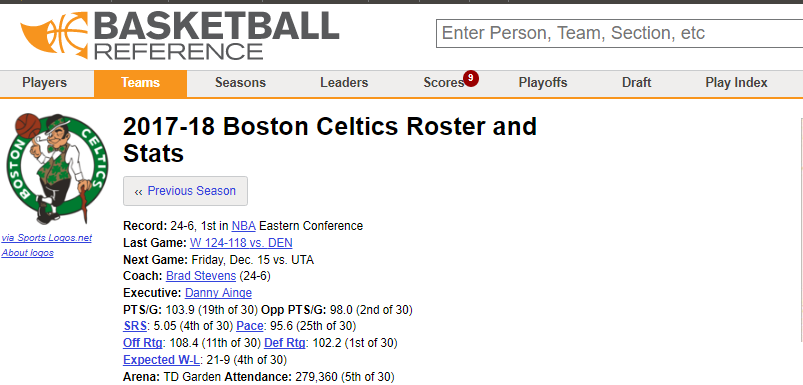
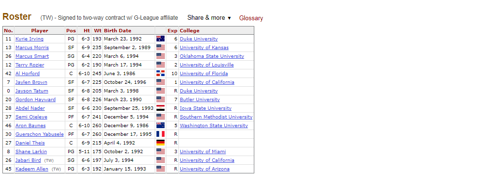

##NBA Stats Package Discription

NBA stats is a package that pulls live NBA statistics from the website https://www.basketball-reference.com/ from 2008 through 2018.

In addition to pulling team statistics directly off of the web, a number of fucntions have been added to pull from the live NBA statistics. 

The package:

1.First, scrapes from the webpages for different statistics

2.Second, combines all the scaped tables into a tibble

3.Third, cleans all the data

4.Fourth, loads the functions

A sample of our functions are the following:

1. A betting function that allows the user to specify the team and get the odds of winning
2. A function to that provides the statistics on a specified match up between teams
3. A function that populates a U.S. map of the games played on a specifeid date, visualize by home team name and arena

To link to our documentation please see here:

A glossary of the the statistics that are available here: ADD!

For picture examples of what each section in the glossary maps to on the website see the following sections below:

"Heading" can be seen on the home page such as "Teams" or "Playoffs". See example:

Subsections, can be selected from a particular heading, such as the "franchise" the Boston Celtics. See example:

Lastly, the list of statistic tables avilable which are pulled directly from the website. See example:

